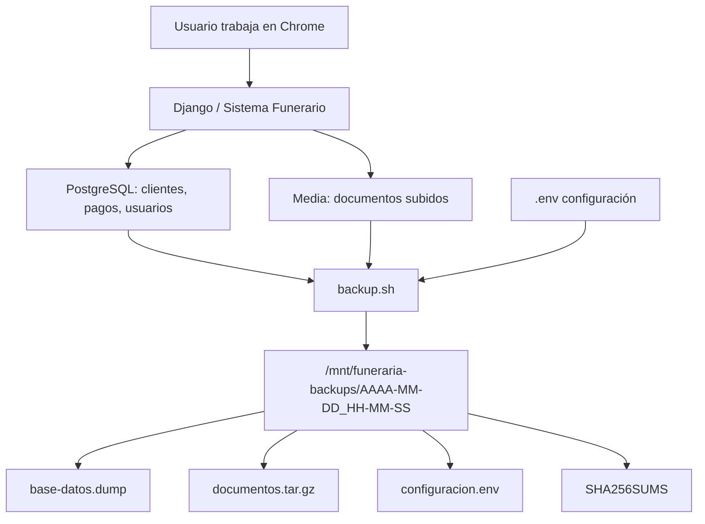
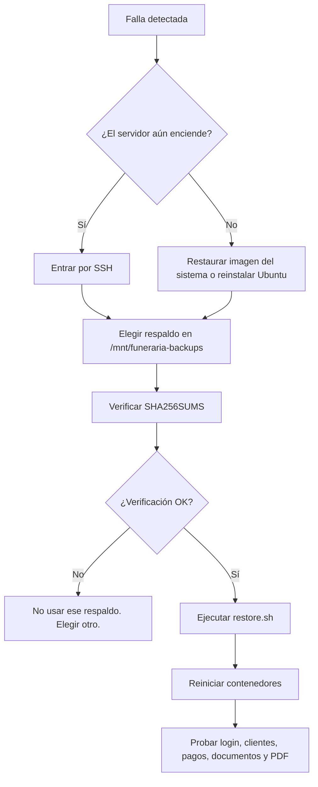
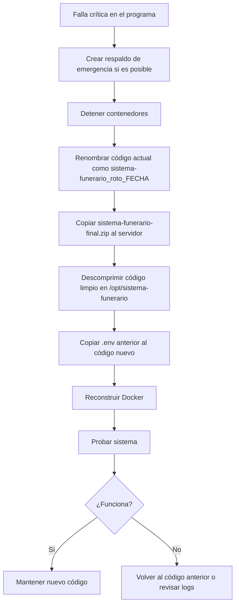

# 08 - Respaldos, Restauración y Falla Crítica del Programa

Este documento es una guía práctica para tres situaciones:

1. hacer respaldos de la base de datos;
2. restaurar la base de datos en caso de falla;
3. recuperar el programa reemplazando los archivos fuente sin perder clientes, pagos ni documentos.

## Rutas Importantes

| Elemento | Ruta en el servidor |
|---|---|
| Código fuente del programa | `/opt/sistema-funerario` |
| Base de datos PostgreSQL | `/srv/funeraria/data/postgres` |
| Documentos subidos | `/srv/funeraria/data/media` |
| Respaldos | `/mnt/funeraria-backups` |
| Archivo de configuración | `/opt/sistema-funerario/.env` |

Regla de oro:

```text
Nunca borre /srv/funeraria/data ni /mnt/funeraria-backups al reemplazar el código.
```

El código se puede reemplazar. La base de datos y los documentos son los datos reales del negocio.

## Diagrama General



## Qué Contiene Cada Respaldo

Cada respaldo queda en una carpeta con fecha y hora:

```text
/mnt/funeraria-backups/2026-06-14_18-30-00
```

Dentro debe tener:

```text
base-datos.dump       Base de datos PostgreSQL.
documentos.tar.gz     Archivos subidos por clientes.
configuracion.env     Copia del archivo .env.
SHA256SUMS            Verificación de integridad.
```

## Hacer un Respaldo Manual Completo

Este es el método recomendado porque respalda base de datos, documentos y configuración.

```bash
cd /opt/sistema-funerario
sudo ./deploy/scripts/backup.sh
```

Verifique que se creó:

```bash
ls -lah /mnt/funeraria-backups
```

Abra la última carpeta:

```bash
ls -lah /mnt/funeraria-backups/AAAA-MM-DD_HH-MM-SS
```

Debe ver:

```text
base-datos.dump
documentos.tar.gz
configuracion.env
SHA256SUMS
```

Verificar integridad:

```bash
cd /mnt/funeraria-backups/AAAA-MM-DD_HH-MM-SS
sha256sum -c SHA256SUMS
```

Si todo está bien, debe mostrar `OK`.

## Hacer Solo Respaldo de la Base de Datos

Use esto si quiere una copia rápida de PostgreSQL sin comprimir documentos.

```bash
cd /opt/sistema-funerario
set -a
source .env
set +a

DEST="/mnt/funeraria-backups/db_manual_$(date +%Y-%m-%d_%H-%M-%S)"
sudo mkdir -p "$DEST"

sudo docker compose exec -T db pg_dump \
  --username "$POSTGRES_USER" \
  --dbname "$POSTGRES_DB" \
  --format custom > "$DEST/base-datos.dump"

sha256sum "$DEST/base-datos.dump" > "$DEST/SHA256SUMS"
ls -lah "$DEST"
```

Verificar:

```bash
cd "$DEST"
sha256sum -c SHA256SUMS
```

## Respaldos Automáticos

Los respaldos automáticos usan systemd.

Archivos:

```text
deploy/funeraria-backup.service
deploy/funeraria-backup.timer
```

Instalar o reactivar:

```bash
cd /opt/sistema-funerario
sudo chmod +x deploy/scripts/*.sh
sudo cp deploy/funeraria-backup.service /etc/systemd/system/
sudo cp deploy/funeraria-backup.timer /etc/systemd/system/
sudo systemctl daemon-reload
sudo systemctl enable --now funeraria-backup.timer
```

Ver estado:

```bash
sudo systemctl status funeraria-backup.timer
```

Ejecutar uno ahora:

```bash
sudo systemctl start funeraria-backup.service
```

Ver historial:

```bash
journalctl -u funeraria-backup.service --no-pager -n 80
```

## Diagrama de Restauración



## Restaurar Respaldo Completo

Advertencia:

```text
Esto reemplaza la base de datos actual por la del respaldo elegido.
```

Primero, si el servidor todavía funciona, cree un respaldo de emergencia:

```bash
cd /opt/sistema-funerario
sudo ./deploy/scripts/backup.sh
```

Luego elija el respaldo a restaurar:

```bash
ls -lah /mnt/funeraria-backups
```

Restaurar:

```bash
cd /opt/sistema-funerario
sudo ./deploy/scripts/restore.sh /mnt/funeraria-backups/AAAA-MM-DD_HH-MM-SS
```

Ejemplo:

```bash
sudo ./deploy/scripts/restore.sh /mnt/funeraria-backups/2026-06-14_18-30-00
```

Después revise:

```bash
sudo docker compose ps
sudo docker compose logs --tail=80 web
```

Abra en Chrome:

```text
http://192.168.1.50:8080
```

Pruebe:

- iniciar sesión;
- abrir lista de clientes;
- abrir una ficha;
- revisar pagos;
- descargar un documento;
- generar contrato PDF.

## Restaurar Solo la Base de Datos

Use esto si los documentos están bien y solo necesita volver la base de datos a un estado anterior.

```bash
cd /opt/sistema-funerario
set -a
source .env
set +a

BACKUP_PATH="/mnt/funeraria-backups/AAAA-MM-DD_HH-MM-SS"
cd "$BACKUP_PATH"
sha256sum -c SHA256SUMS

cd /opt/sistema-funerario
sudo docker compose exec -T db dropdb \
  --username "$POSTGRES_USER" \
  --if-exists "$POSTGRES_DB"

sudo docker compose exec -T db createdb \
  --username "$POSTGRES_USER" \
  "$POSTGRES_DB"

sudo docker compose exec -T db pg_restore \
  --username "$POSTGRES_USER" \
  --dbname "$POSTGRES_DB" \
  --clean \
  --if-exists < "$BACKUP_PATH/base-datos.dump"

sudo docker compose restart web
```

Luego pruebe el sistema en Chrome.

## Falla Crítica del Programa: Reemplazar Archivos Fuente

Use este procedimiento si:

- el sistema dejó de funcionar por cambios en el código;
- se dañaron archivos fuente;
- se borró una plantilla;
- se rompió `settings.py`, `views.py`, `models.py`, etc.;
- quiere volver a una copia limpia del programa.

Este procedimiento no borra:

```text
/srv/funeraria/data
/mnt/funeraria-backups
```

## Diagrama de Reemplazo de Código



## Paso 1: Copiar el ZIP al Servidor

Desde Windows PowerShell:

```powershell
scp "C:\proyectos\sistema-funerario-final.zip" funerariaadmin@192.168.1.50:/tmp/
```

Si está fuera de la red y usa Tailscale, puede usar la IP o nombre Tailscale del servidor.

Luego entre por SSH:

```powershell
ssh funerariaadmin@192.168.1.50
```

## Paso 2: Respaldo de Emergencia

En el servidor:

```bash
cd /opt/sistema-funerario
sudo ./deploy/scripts/backup.sh
```

Si el script no funciona porque el código está muy roto, haga respaldo manual de la base y documentos.

Primero cargue variables:

```bash
cd /opt/sistema-funerario
set -a
source .env
set +a
```

Cree carpeta:

```bash
DEST="/mnt/funeraria-backups/emergencia_codigo_roto_$(date +%Y-%m-%d_%H-%M-%S)"
sudo mkdir -p "$DEST"
```

Respalde base de datos:

```bash
sudo docker compose exec -T db pg_dump \
  --username "$POSTGRES_USER" \
  --dbname "$POSTGRES_DB" \
  --format custom > "$DEST/base-datos.dump"
```

Respalde documentos:

```bash
sudo tar -C "$DATA_DIR" -czf "$DEST/documentos.tar.gz" media
```

Copie configuración:

```bash
sudo cp .env "$DEST/configuracion.env"
sudo chmod 600 "$DEST/configuracion.env"
sha256sum "$DEST"/* > "$DEST/SHA256SUMS"
```

## Paso 3: Detener Contenedores

```bash
cd /opt/sistema-funerario
sudo docker compose down
```

Esto detiene el programa, pero no borra datos persistentes.

## Paso 4: Guardar el Código Roto Como Copia

```bash
STAMP="$(date +%Y-%m-%d_%H-%M-%S)"
cd /opt
sudo mv sistema-funerario "sistema-funerario_roto_$STAMP"
```

Con esto conserva el código viejo por si necesita revisar algo.

## Paso 5: Descomprimir Código Limpio

```bash
cd /tmp
rm -rf sistema-funerario-nuevo
mkdir sistema-funerario-nuevo
unzip -q /tmp/sistema-funerario-final.zip -d /tmp/sistema-funerario-nuevo
```

Crear carpeta nueva:

```bash
sudo mkdir -p /opt/sistema-funerario
```

Copiar contenido:

```bash
sudo cp -a /tmp/sistema-funerario-nuevo/sistema-funerario-final/. /opt/sistema-funerario/
```

## Paso 6: Recuperar `.env`

El ZIP no debe traer su `.env` real. Debe recuperar el `.env` anterior:

```bash
sudo cp "/opt/sistema-funerario_roto_$STAMP/.env" /opt/sistema-funerario/.env
```

Si no existe, use el respaldo:

```bash
sudo cp /mnt/funeraria-backups/AAAA-MM-DD_HH-MM-SS/configuracion.env /opt/sistema-funerario/.env
```

Revise:

```bash
sudo nano /opt/sistema-funerario/.env
```

Confirme especialmente:

```text
DATA_DIR=/srv/funeraria/data
BACKUP_DIR=/mnt/funeraria-backups
POSTGRES_HOST=db
DJANGO_ALLOWED_HOSTS=...
DJANGO_CSRF_TRUSTED_ORIGINS=...
```

## Paso 7: Permisos

```bash
sudo chown -R funerariaadmin:funerariaadmin /opt/sistema-funerario
cd /opt/sistema-funerario
sudo chmod +x deploy/scripts/*.sh
```

Si su usuario no se llama `funerariaadmin`, cambie el comando por su usuario real:

```bash
whoami
```

## Paso 8: Reconstruir y Levantar

```bash
cd /opt/sistema-funerario
sudo docker compose up -d --build
```

Ver estado:

```bash
sudo docker compose ps
```

Ver logs:

```bash
sudo docker compose logs --tail=100 web
sudo docker compose logs --tail=100 nginx
sudo docker compose logs --tail=100 db
```

## Paso 9: Probar

Abra:

```text
http://192.168.1.50:8080
```

Y si usa Tailscale:

```text
https://servidor-funeraria.example.ts.net/
```

Pruebe:

```text
[ ] Login.
[ ] Lista de clientes.
[ ] Abrir ficha.
[ ] Registrar pago de prueba si corresponde.
[ ] Descargar contrato PDF.
[ ] Subir y descargar documento de prueba.
[ ] Entrar a /admin/.
```

## Si El Código Nuevo No Funciona

Revise logs:

```bash
cd /opt/sistema-funerario
sudo docker compose logs --tail=200 web
```

Si necesita volver al código anterior:

```bash
cd /opt/sistema-funerario
sudo docker compose down

cd /opt
sudo mv sistema-funerario "sistema-funerario_fallido_$(date +%Y-%m-%d_%H-%M-%S)"
sudo mv sistema-funerario_roto_FECHA sistema-funerario

cd /opt/sistema-funerario
sudo docker compose up -d
```

Cambie `sistema-funerario_roto_FECHA` por el nombre real de la carpeta guardada.

## Falla Total del SSD

Si el SSD falla completamente:

1. reemplazar SSD;
2. reinstalar Ubuntu Server;
3. instalar Docker;
4. montar el HDD en `/mnt/funeraria-backups`;
5. copiar el código limpio a `/opt/sistema-funerario`;
6. copiar `.env` desde `configuracion.env`;
7. levantar Docker;
8. restaurar último respaldo.

Comandos principales después de reinstalar:

```bash
sudo apt update
sudo apt install -y docker.io docker-compose-v2 unzip
sudo systemctl enable --now docker
sudo mkdir -p /opt/sistema-funerario /srv/funeraria/data /mnt/funeraria-backups
```

Copiar código y `.env`:

```bash
sudo unzip /tmp/sistema-funerario-final.zip -d /tmp/sistema-funerario-nuevo
sudo cp -a /tmp/sistema-funerario-nuevo/sistema-funerario-final/. /opt/sistema-funerario/
sudo cp /mnt/funeraria-backups/ULTIMO_RESPALDO/configuracion.env /opt/sistema-funerario/.env
```

Levantar y restaurar:

```bash
cd /opt/sistema-funerario
sudo docker compose up -d --build
sudo ./deploy/scripts/restore.sh /mnt/funeraria-backups/ULTIMO_RESPALDO
```

## Checklist de Emergencia

Antes de tocar algo:

```text
[ ] Confirmé cuál es la falla.
[ ] Confirmé que /srv/funeraria/data existe.
[ ] Confirmé que /mnt/funeraria-backups está montado.
[ ] Hice respaldo de emergencia si era posible.
[ ] No borré DATA_DIR.
[ ] No borré BACKUP_DIR.
[ ] Guardé copia del código roto.
[ ] Copié .env al código nuevo.
[ ] Reconstruí Docker.
[ ] Probé login, clientes, pagos, documentos y PDF.
```

## Comandos de Diagnóstico Rápido

```bash
cd /opt/sistema-funerario
sudo docker compose ps
sudo docker compose logs --tail=100 web
sudo docker compose logs --tail=100 nginx
sudo docker compose logs --tail=100 db
findmnt /mnt/funeraria-backups
df -h /srv/funeraria/data
df -h /mnt/funeraria-backups
```

## Resumen Corto

Para respaldar:

```bash
cd /opt/sistema-funerario
sudo ./deploy/scripts/backup.sh
```

Para restaurar:

```bash
cd /opt/sistema-funerario
sudo ./deploy/scripts/restore.sh /mnt/funeraria-backups/AAAA-MM-DD_HH-MM-SS
```

Para reemplazar código roto:

```bash
cd /opt/sistema-funerario
sudo ./deploy/scripts/backup.sh
sudo docker compose down
cd /opt
sudo mv sistema-funerario sistema-funerario_roto_$(date +%Y-%m-%d_%H-%M-%S)
sudo unzip /tmp/sistema-funerario-final.zip -d /tmp/sistema-funerario-nuevo
sudo mkdir -p /opt/sistema-funerario
sudo cp -a /tmp/sistema-funerario-nuevo/sistema-funerario-final/. /opt/sistema-funerario/
sudo cp /opt/sistema-funerario_roto_FECHA/.env /opt/sistema-funerario/.env
cd /opt/sistema-funerario
sudo docker compose up -d --build
```
